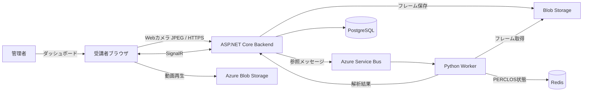

# AwakeVerify

Webカメラ映像から受講者の覚醒状態を推定し、オンデマンド動画教材の実質未受講を防ぐための受講完了検証システムです。眠気を検知すると動画を自動停止し、眠気スコアと停止履歴を管理者ダッシュボードで確認できます。

> このリポジトリでは、ユーザー価値と受け入れ条件の一次仕様を [`docs/features/`](docs/features/) と [`docs/scenarios/`](docs/scenarios/) に置いています。実装・変更の判断ではこれらを優先してください。

## 主な機能

- 学籍番号による受講セッションの開始
- Webカメラ映像の取得（640×480、5fps相当）と、JPEGフレームのHTTPS binary送信
- MediaPipe Face Landmarkerによる顔ランドマーク推定、個人別キャリブレーション、PERCLOSベースの眠気スコアリング
- `danger` レベル時の動画自動停止と、正常状態に復帰するまでの再開制御
- SignalRによる解析結果のリアルタイム通知
- 眠気スコア、自動停止・再開・完了イベントの保存と、管理者ダッシュボードでの可視化
- Service Bus Sessionを使ったセッション内順序保証と、Workerの水平スケール

## アーキテクチャ



フレームはBackendがBlob Storageへ永続化し、Service Busへ参照を投入した後にのみ受理されます。WorkerはBlobからフレームを取得して非同期解析し、結果をBackend経由でPostgreSQLへ保存・SignalR配信します。

## 技術構成

| 領域 | 主な技術 |
| --- | --- |
| Frontend | Next.js 16、React、TypeScript、SignalR、shadcn/ui |
| Backend | ASP.NET Core (.NET 10)、EF Core、SignalR |
| Worker | Python 3.12、MediaPipe、OpenCV、NumPy |
| データ・メッセージング | PostgreSQL、Redis、Azure Blob Storage、Azure Service Bus |
| 実行基盤 | Docker Dev Containers、Azure Container Apps、Azure SignalR Service |

## リポジトリ構成

```text
.
├── docs/
│   ├── features/        # 一次仕様: 機能ごとの受け入れ条件
│   ├── scenarios/       # 一次仕様: E2Eシナリオ
│   ├── frontend/        # Frontend二次仕様
│   ├── backend/         # Backend二次仕様
│   └── worker/          # Worker二次仕様
├── src/
│   ├── frontend/        # Next.jsアプリケーション
│   ├── backend/         # ASP.NET Core APIとテスト
│   └── worker/          # フレーム解析Workerとテスト
├── .devcontainer/       # ローカル依存サービスを含む開発環境
└── infra/azure/         # Azure Container Apps向けBicep・運用スクリプト
```

## ローカル開発

### 前提条件

- Docker と Dev Containers対応エディタ（推奨）
- Webカメラを使う場合は、ホストでカメラデバイスへのアクセスが許可されていること
- 開発コンテナ外で実行する場合: Node.js / pnpm、.NET SDK 10、Python 3.12、Docker Compose

開発コンテナはPostgreSQL、Redis、Azurite、Azure Service Bus Emulatorを起動します。ローカルE2Eでも、フレームのファイル保存・ログ出力だけによる代替経路は利用しません。

### 1. 開発コンテナを起動する

```bash
cp .devcontainer/.env.example .devcontainer/.env
```

`.devcontainer/.env` に必要なローカル用の値を設定した後、エディタで **Reopen in Container** を実行してください。初回作成時に依存パッケージとPlaywright Chromiumがインストールされます。

カメラを開発コンテナに渡すには、ホストの `/dev/video0` が利用可能であること、および必要に応じて `.devcontainer/.env` の `HOST_VIDEO_GID` を設定することが必要です。

### 2. 各サービスを起動する

開発コンテナ内で、以下を別々のターミナルで実行します。

```bash
# Backend: http://localhost:5194
cd src/backend
dotnet run --project Awaver.Backend/Awaver.Backend.csproj --launch-profile http
```

```bash
# Worker health: http://localhost:8000/health
cd src/worker
source .venv/bin/activate
worker-app
```

```bash
# Frontend: http://localhost:3000
cd src/frontend
pnpm dev
```

ブラウザで [http://localhost:3000](http://localhost:3000) を開き、学籍番号を入力して受講を開始します。動画教材はBlob Storageから配信されるため、ローカルではアクセス可能な教材動画のURLを `LESSON_VIDEO_URL` に設定してください。未設定時の動画IDは `default` です。

Backendのヘルスエンドポイントは `/health/live` と `/health/ready`、Workerのヘルスエンドポイントは `/health` です。

## テストと品質確認

各コマンドは該当ディレクトリで実行します。E2Eの前に、Frontend、Backend、Workerと開発コンテナの依存サービスをすべて起動してください。

```bash
# Frontend lint
cd src/frontend
pnpm lint

# Frontend E2E（Chromiumは初回のみインストール）
pnpm exec playwright install --with-deps chromium
pnpm test:e2e

# Backend unit / integration tests
cd ../backend
dotnet test Awaver.Backend.slnx

# Worker tests
cd ../worker
source .venv/bin/activate
python -m unittest discover -s tests
```

E2Eが検証する対象は、受講セッション作成、カメラ権限、Backend/Workerの接続確認、HTTP binary frame ingress、SignalR接続、キャリブレーション開始可能状態です。詳細は [`src/frontend/README.md`](src/frontend/README.md) を参照してください。

## 仕様とシナリオ

代表的な統合シナリオは以下のとおりです。

- [受講者の通常受講](docs/scenarios/student-learning-happy-path.md)
- [キャリブレーション失敗と再試行](docs/scenarios/calibration-retry.md)
- [眠気検知による自動停止と再開](docs/scenarios/drowsiness-auto-pause-resume.md)
- [教員による受講状況確認](docs/scenarios/teacher-dashboard-review.md)
- [複数受講セッションの動的分散](docs/scenarios/multi-session-dynamic-distribution.md)

機能一覧は [`docs/features/README.md`](docs/features/README.md)、シナリオ一覧は [`docs/scenarios/README.md`](docs/scenarios/README.md) にあります。

## Azureへの配置

Azure Container Appsを使った非本番の分散負荷テスト用IaCを [`infra/azure/`](infra/azure/) に含めています。Azureへの配置には、Service Bus、Blob Storage、PostgreSQL、Redis、SignalR、Microsoft Entra IDの設定と、Git管理外の秘密パラメータファイルが必要です。

- 配置手順・負荷試験: [`infra/azure/README.md`](infra/azure/README.md)
- 本番セットアップ・秘密情報管理: [`docs/operations/production-setup.md`](docs/operations/production-setup.md)

> **注意:** Azureリソースには料金が発生します。実行前にクォータ、予算、リソースの削除手順を確認してください。接続文字列、APIキー、初期管理者パスワードなどの秘密情報をGit・ログ・チャットへ保存しないでください。

## 開発時の方針

変更は、まず対象のFeatureまたはScenarioを確認してから行います。UI、API、Workerの実装仕様が競合する場合は、`docs/features/` と `docs/scenarios/` を優先します。詳細な作業規約は [`AGENTS.md`](AGENTS.md) を参照してください。
