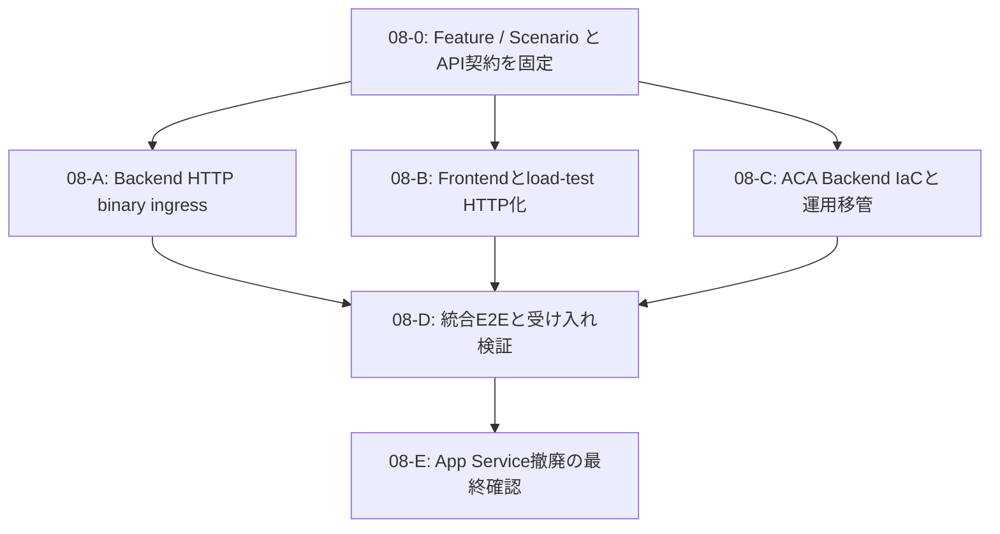

# Task 08: HTTP binary frame ingress 化と ACA Backend 移管を完了する

以下をそのまま実装 Agent への依頼文として使用する。

---

あなたはこのリポジトリの Backend transport・Azure Container Apps 移行・信頼性検証担当 Agent です。作業ルートは `workspace` です。

## Scenario

対象は [`docs/scenarios/multi-session-dynamic-distribution.md`](../../scenarios/multi-session-dynamic-distribution.md) です。

複数の受講 Session が同時に独立 JPEG frame を送信しても、同一 `sessionId` の Worker 処理順序を守り、異なる Session は並列に処理され、Worker 結果と SignalR 通知をサイレントロス・誤配送なく配信できることを満たしてください。

この Task の最終トポロジーは次です。

```text
Browser / Devcontainer load-test CLI
→ Backend ACA の HTTPS binary frame API
→ Blob Storage
→ Azure Service Bus Session queue
→ Worker ACA
→ Backend ACA の analysis-results API / PostgreSQL / Outbox
→ Azure SignalR
→ Browser / Devcontainer load-test CLI
```

画像フレームのための raw WebSocket は最終成果物に残してはなりません。Azure SignalR による解析結果通知は維持します。

## 依存と既知の状態

- Task 01–07 は実装済みとして、既存コード・テスト・仕様を確認してください。
- Backend は現在 ASP.NET Core、Worker は Python、Frontend / load-test は TypeScript です。
- frame は独立デコード可能な `image/jpeg` です。I/P、GOP、前 frame 参照を復活させてはなりません。
- Session 順序は Azure Service Bus Session と `sessionId` が担います。
- 結果保存と Outbox は同一 PostgreSQL transaction の受理境界です。変更してはなりません。
- 複数 Backend replica の Azure SignalR と Redis connection registry は既に実装済みです。
- Backend observability は Application Insights へ metrics-only で出力します。`sessionId`、学生 ID、Cookie、token、URL、SAS、payload を telemetry に含めてはなりません。
- Azure for Students では App Service S1 VM quota により Backend を 2 instance に scale できない状態が確認されています。一方、既存 ACA environment の Consumption cores quota は確認済みです。実際の quota とコスト上限を再確認してください。
- public GHCR の immutable tag を使います。ACR は使用してはなりません。

## Subagent 分割・依存関係（必須）

この Task は大きいため、以下の dependency graph と write scope を守って Subagent を使ってください。Subagent に同じファイルを同時編集させてはなりません。Coordinator は各 Agent にこの Scenario、固定済み contract、依存先、write scope、禁止事項を共有してください。



### 08-0: 仕様・契約固定 Agent（最初に単独実行）

**依存:** なし。  
**write scope:**

- `docs/features/03-video-frame-sending.md`
- `docs/features/04-frame-storage-and-queue.md`
- `docs/features/09-realtime-notification.md`（必要な参照修正のみ）
- `docs/features/15-elastic-session-frame-processing.md`
- `docs/scenarios/multi-session-dynamic-distribution.md`
- `docs/backend/spec.md`
- `docs/frontend/**` の仕様文書
- `docs/worker/spec.md` の必要最小限の責務記述

**責務:**

- 下記「Frame transport の最終契約」を一次仕様として矛盾なく確定する。
- HTTP endpoint、binary body、metadata header、durable `202`、status分類、retry、冪等性、Sessionごとの1 in-flight、skip時の欠番、SignalRの役割を固定する。
- raw frame WebSocket の撤廃を明記する。
- API contract が確定したら、Coordinator へ次だけを簡潔に handoff する。実装 Agent はこの contract を再解釈してはならない。

```text
- HTTP method / route
- required request headers / binary body / size limit
- success / retryable / permanent status
- idempotency key と duplicate conflict 規則
- Session順序、skip、再送規則
- SignalRが維持する契約
```

**禁止:** `src/**`、`infra/**`、load-test 実装、Azure deploy の変更。

### 08-A: Backend HTTP binary ingress Agent

**依存:** 08-0 の contract handoff 完了後。  
**並列:** 08-B、08-C と並列実行可能。  
**write scope:**

- `src/backend/**`
- `src/backend/Awaver.Backend.Tests/**`
- Backend 実装に密接に対応する `docs/backend/**` の補足のみ。ただし 08-0 が更新した一次仕様は編集しない。

**責務:**

- HTTP binary endpoint、認可、CSRF、bounded body read、JPEG validation、Blob / Service Bus durable acceptance、idempotency、privacy-safe metrics、Forwarded Headers / HTTPS behavior を実装する。
- frame WebSocket route / handler / DTO / backend-only test を削除・置換する。
- `FramePipeline`、Worker result API、Outbox、SignalR Hub の既存契約を壊さない。
- Backend 単体・API・ローカル依存サービス test を実行する。

**禁止:** `src/frontend/**`、`infra/**`、Feature / Scenario 一次仕様、Worker 実装、Azure高負荷実行。

### 08-B: Frontend・load-test HTTP transport Agent

**依存:** 08-0 の contract handoff 完了後。  
**並列:** 08-A、08-C と並列実行可能。  
**write scope:**

- `src/frontend/**`
- frontend / load-test に対応する `docs/frontend/**`
- `src/frontend/load-test/README.md`

**責務:**

- 実 Frontend と Devcontainer load-test CLI の frame sender を HTTP binary upload に切り替える。
- Sessionごとの Cookie jar / principal、1 in-flight、offered / sent / skipped、retryable status の同一 sequence 再送、SignalR result subscription・reconnect・誤配送検出を実装・テストする。
- frame WebSocket 専用 client / dependency / fault injection を削除する。ただし SignalR が内部で WebSocket transport を使うことは維持する。
- package lockfile を変更する必要がある場合は、この Agent だけが変更する。

**禁止:** `src/backend/**`、`infra/**`、Feature / Scenario 一次仕様、Worker 実装、Azure高負荷実行。

### 08-C: ACA Backend IaC・運用移管 Agent

**依存:** 08-0 の contract handoff 完了後。  
**並列:** 08-A、08-B と並列実行可能。  
**write scope:**

- `infra/azure/**`
- `docs/operations/**`
- `docs/implementation-plans/elastic-scaling-agent-prompts/**` の実行順・運用参照だけ。Feature / Scenario 一次仕様は編集しない。

**責務:**

- App Service / Plan / autoscale を最終 IaC、script、README、parameter から撤廃し、Backend ACA external HTTP ingress、probe、secret、replica、HTTP scale rule、Application Insights metrics-only、Worker Backend ACA URL を構成する。
- ACA quota と cost を read-only 照会し、Bicep compile / group validate を行う。
- image publish、実 Azure deploy、App Service deletion、高負荷試験は行わない。これらは 08-D / 08-E の明示承認後だけとする。

**禁止:** `src/backend/**`、`src/frontend/**`、Feature / Scenario 一次仕様、Worker 実装。

### 08-D: 統合 E2E・受け入れ検証 Agent

**依存:** 08-A、08-B、08-C の完了と、各 Agent の test / validation 結果。  
**並列:** 不可。  
**write scope:** 原則なし。明確に検証で発見した不具合だけを、所有 Agent の write scope に委譲する。Coordinator が単独で修正する必要がある場合も、最小限の対象ファイルだけを編集する。

**責務:**

- API contract が実装・Frontend / CLI・ACA IaC で一致していることを確認する。
- local E2E、Bicep validation、Backend ACA smoke の実行手順と結果を scenario 単位で統合する。
- raw frame WebSocket への依存が残っていないことを確認する。
- Azure高負荷は実行しない。対象環境・コスト上限・明示 `START` がそろった場合だけ実行する。

### 08-E: App Service撤廃・切替 Agent

**依存:** 08-D の ACA Backend smoke 成功、rollback 手順、明示的な実デプロイ承認。  
**並列:** 不可。  
**write scope:** 原則なし。Azure control-plane 操作と最終状態確認のみ。

**責務:**

- immutable GHCR image tag が公開済みであることを確認する。
- Backend ACA へのデプロイ、Worker の Backend URL 切替、health、HTTP frame smoke、SignalR通知、metrics export を確認する。
- App Service resource の削除は、ACAで同等の経路が成功し、rollback不能なデータ破壊がないことを確認してからのみ実施する。
- 実行前にコスト影響と削除対象を表示し、ユーザーが明示承認した場合だけ変更する。

### 並列実行時の共通ルール

- 08-0 の API contract handoff 前に、08-A / 08-B / 08-C を開始してはならない。
- 08-A / 08-B / 08-C は、固定済みの endpoint・status・順序契約を変更してはならない。変更が必要になった場合は停止し、Coordinator に 08-0 の仕様修正を依頼する。
- 08-A / 08-B / 08-C は互いの write scope のファイルを編集しない。
- `Program.cs`、Backend project package file、Backend migration、`AnalysisOutboxDispatcher.cs` は 08-A の専有とする。
- Frontend package manifest / lockfile、load-test report schema、load-test README は 08-B の専有とする。
- `infra/azure/main.bicep`、parameter file、Azure deploy script、`infra/azure/README.md`、operations docs は 08-C の専有とする。
- 08-D は uncommitted state を確認してから統合する。別 Agent の未完了変更を revert・format・移動してはならない。
- 各 Agent は、変更ファイル、固定契約への適合、実行した test、未実施の Azure 操作を handoff に含める。

## 最重要ルール

1. 最初に `AGENTS.md` を読む。
2. 実装判断は Feature / Scenario first とし、以下をこの順で読む。
   - `docs/features/03-video-frame-sending.md`
   - `docs/features/04-frame-storage-and-queue.md`
   - `docs/features/09-realtime-notification.md`
   - `docs/features/15-elastic-session-frame-processing.md`
   - `docs/scenarios/multi-session-dynamic-distribution.md`
3. 外部挙動を変えるため、実装前に一次仕様と scenario を更新する。Backend / Frontend / Worker spec は二次仕様として整合させる。
4. raw JPEG frame 用 WebSocket endpoint を最終的に完全撤廃する。`/ws/sessions/{sessionId}/frames`、WebSocket frame client、`ws` 依存が frame 送信用にだけ使われている場合は削除する。
5. Azure SignalR の Hub、`JoinSession(sessionId)`、Session 分離、解析結果通知は撤廃・縮小・polling 化してはならない。
6. Worker ACA に HTTP / WebSocket で直接接続してはならない。frame client の接続先は常に Backend HTTPS endpoint だけである。
7. Client は frame payload、Cookie、CSRF token、Bearer token、学生 ID、`sessionId`、SAS、接続文字列をログ・レポート・metric dimension に出してはならない。
8. 高負荷 Azure 実行は `ALLOW_AZURE_LOAD_TEST=true` と TTY 上の明示 `START` を必要とする。承認なしに高負荷を実行してはならない。
9. App Service を最終 IaC・運用手順・出力から撤廃する。App Service Plan、App Service autoscale、`WEBSITES_PORT`、App Service hostname 依存を残してはならない。
10. `git --no-pager diff --check` を使用してはならない。
11. 秘密値を Git 管理対象、deployment output、Azure CLI の表示、ログへ出してはならない。
12. 既存の未コミット変更・load-test report を上書き、削除、revert してはならない。

## 一次仕様を先に更新する

以下を仕様として明文化し、既存の WebSocket / Base64 記述を矛盾なく置換してください。同一内容を重複させず、Feature / Scenario を一次情報にしてください。

### Frame transport の最終契約

1. raw JPEG frame は HTTPS request body の binary `image/jpeg` として Backend に送る。
2. frame metadata は route と固定 header で送る。最小契約は次とする。

```http
POST /api/sessions/{sessionId}/frames/{sequenceNo}
Content-Type: image/jpeg
X-CSRF-Token: <existing CSRF token>
X-Frame-Captured-At: 2026-07-15T09:00:00.000Z
X-Frame-Video-Time-Sec: 12.4

<raw JPEG bytes>
```

- `sessionId` は route parameter と認証 Cookie の Session が一致しなければならない。
- `sequenceNo` は正の整数である。
- `capturedAt` は UTC timestamp、`videoTimeSec` は 0 以上の有限値である。
- codec は endpoint の `Content-Type: image/jpeg` により固定する。JSON / Base64 payload は受理しない。
- 既存の JPEG size、JPEG validity、metadata 制約を保つ。request body の上限を proxy と ASP.NET Core の双方で明示し、chunked request でも上限を超えて読まない。

3. `202 Accepted` は Blob 保存と Service Bus Session queue enqueue の両方が成功した durable acceptance boundary を意味する。単に HTTP を受信しただけで `202` を返してはならない。
4. route の `(sessionId, sequenceNo)` は frame 再送の冪等性単位である。同一 frame の timeout 後再送は成功として扱い、同一 key に異なる metadata / JPEG を送る場合は明確な conflict とする。
5. retry 可能な依存障害は `503 Service Unavailable`、明示的な Backend admission / capacity 制御は `429 Too Many Requests` とし、必要なら `Retry-After` を返す。不正 JPEG / metadata は `400`、サイズ超過は `413`、認可・CSRF失敗は既存の `401` / `403` 契約に従う。
6. frame client は Session ごとに **最大 1 in-flight HTTP frame request** とする。`sequence N` の durable acceptance を受けるまで `N+1` を送ってはならない。
7. 5 fps は capture / offered rate である。200ms の次 tick に前 request が in-flight なら、古い frame を client queue に貯めず、その tick の frame を送信しない。`sequenceNo` は capture ごとに増加し、意図的な欠番を許容する。Worker は既存 Feature 15 のとおり欠番を理由に後続の独立 JPEG を破棄しない。
8. 同一 Session の順序は「Client の 1 in-flight 制約により Backend が sequence 順に Service Bus Session queue へ enqueue する」ことで維持する。HTTP/2 stream の送信順・完了順に依存してはならない。
9. 異なる Session の request は並列に処理できる。
10. SignalR は解析結果通知専用であり、JPEG frame を送らない。

仕様更新対象は少なくとも以下です。

- `docs/features/03-video-frame-sending.md`
- `docs/features/04-frame-storage-and-queue.md`
- `docs/features/09-realtime-notification.md`（frame WebSocket を SignalR と混同しないよう必要な参照のみ）
- `docs/features/15-elastic-session-frame-processing.md`
- `docs/scenarios/multi-session-dynamic-distribution.md`
- `docs/backend/spec.md`
- `docs/frontend/` の関連仕様
- `docs/worker/spec.md`（Worker が HTTP frame client ではないこと、および Backend URL の責務を明記する必要がある場合）

## 実装: HTTP binary frame ingress

### Backend

既存の frame validation、Blob storage、Service Bus enqueue、`FramePipeline`、認可、CSRF、health、metrics の実装を調査して最小の変更で再利用してください。

- HTTP endpoint は raw body を扱い、Base64 decode と frame JSON parse を完全に除去する。
- 可能な限り JPEG bytes を stream で扱う。既存 JPEG validator が byte array を要求する場合でも、上限 1 MiB の範囲で明示的に bounded read とする。無制限 buffering を追加してはならない。
- 既存 `FramePipeline` が Blob 保存後に Service Bus へ `sessionId` を Session ID として enqueue する契約を維持する。
- `MessageId`、Blob path、idempotency の既存設計を調査し、HTTP retry が queue / Blob / Worker 結果を重複させないようにする。並行 POST での race は PostgreSQL / Blob / Service Bus の実際の保証に基づいて処理し、推測で成功扱いにしてはならない。
- endpoint は `202` を返す前に Blob と queue の両方を完了させる。
- `429` の admission control を追加する場合は、環境依存の固定利用者数ではなく設定値を用い、`Retry-After` と client 動作を仕様・テストで固定する。最初に必要性が確認できなければ、無根拠な rate limiter を追加しない。
- frame ingress metrics を追加する。少なくとも request count、outcome、duration、accepted binary bytes を測定する。tag は固定の outcome / stage のみとし、ID・payload・URL・例外本文を含めない。
- metrics-only の Azure Monitor pipeline を保つ。HTTP trace、dependency trace、application log export を有効にして識別子や SAS を送ってはならない。
- ACA ingress の TLS termination を前提に、`UseHttpsRedirection` と Forwarded Headers を安全に設定する。任意 client が偽造した forwarded header を無条件に信頼してはならない。ACA 経由の `/health/live`、`/health/ready`、API、SignalR negotiate が redirect loop にならないことをテストする。
- raw frame WebSocket handler、route、関連 DTO、frame WebSocket 専用 test を削除または HTTP test に置換する。最終コード・最終 docs・load-test README に frame WebSocket 契約を残してはならない。

### Frontend と load-test CLI

- 実アプリの frame sender と `src/frontend/load-test/` の双方を HTTP binary endpoint へ切り替える。
- `fetch` または既存依存で HTTPS request を行い、browser / Node の keep-alive / connection reuse を妨げない。1 frame ごとの TLS 接続を明示的に新規作成してはならない。
- 各仮想 Session は独立 Cookie jar / principal を維持する。
- Session ごとに 1 in-flight だけを許可する。前 request が in-flight の tick は送らず、`framesNotSentDueToInFlightLimit` を増やす。
- `framesOffered` は capture / scheduler tick、`framesSent` は実 HTTP request、accepted / retryable rejection / permanent rejection / retransmission を意味の重複なく報告する。
- HTTP transient failure の再送は同じ `sequenceNo` と同じ JPEG bytes / metadata を使う。再送後も次 sequence をリセットしない。
- `skip-sequence`、`duplicate-frame`、SignalR reconnect の障害注入を HTTP transport に合わせて維持する。`ws-reconnect` は frame transport から削除する。SignalR reconnect は維持する。
- load-test CLI は Worker、Blob、Service Bus、Redis、PostgreSQL に直接接続してはならない。
- Client の通常ログ・JSON report に request URL、Cookie、token、student ID、`sessionId`、raw JPEG / Base64 を出力してはならない。
- frame WebSocket 専用の `ws` package が他用途で不要なら依存と lockfile から削除する。SignalR の WebSocket transport 自体は `@microsoft/signalr` が管理するため削除対象ではない。

### Worker

- Worker の frame 処理、Service Bus Session receiver、Blob read、解析、`POST /analysis-results`、retry / dead-letter / idempotency 契約を変更しない。
- Worker が Backend ACA の ingress URL を使うよう IaC の環境変数を更新する。Worker は Backend ACA の `/health/ready` と analysis-results API にのみ接続する。
- Worker は frame upload endpoint を呼び出してはならない。

## 実装: App Service を撤廃し Backend を ACA に移管する

最終的な Azure IaC では Backend の App Service 利用を完全に除去してください。移行途中の検証で一時的に併存させる場合でも、完了条件を満たす最終 commit に App Service resource / deploy path を残してはなりません。

### IaC 要件

`infra/azure/` を調査し、既存 Worker ACA と同じ managed environment に `backendContainerApp` を構成してください。

1. `Microsoft.Web/serverfarms`、`Microsoft.Web/sites`、App Service autoscale resource、App Service 固有 parameter / documentation / deployment command を削除する。
2. Backend ACA は external HTTPS HTTP ingress を持つ。
   - target port は Backend image の listen port `8080`
   - HTTP ingress は TLS を ACA で終端する
   - custom domain は要件にない限り追加しない
   - Backend ACA FQDN を output に secret を含めず公開する
3. Backend ACA の `minReplicas`、`maxReplicas`、HTTP concurrent request threshold、CPU、memory、termination grace period は IaC parameter 化する。特定の利用者数をコードに固定しない。
4. 非本番の burst 検証では、App Service quota に依存せず Backend minimum replica を 2 とする parameter default を検討する。ただし実際の ACA quota、Azure for Students credit、コスト上限を確認し、環境別 parameter file で明示する。
5. Backend ACA の HTTP scale rule は request concurrency を使用する。しきい値は 5 fps / session の数を推測して固定せず、frame ingress と analysis-results の duration / CPU / memory を測定した初期値として文書化し、調整可能にする。
6. `activeRevisionsMode: Single` を使用する。revision 更新時に旧 revision が frame / result を二重処理しないことを確認する。
7. Backend container に startup、liveness、readiness probe を追加する。
   - `/health/live` はプロセス応答だけを見る。
   - `/health/ready` は依存サービスを確認する。
   - ACA scale-in / revision shutdown 時は、新規 ingress を安全に外し、Outbox dispatcher が新規 claim を停止し、既存 lease を Feature 15 契約に従って処理する。
8. Backend の PostgreSQL、Blob、Service Bus sender、Redis、Azure SignalR、Application Insights connection string、Worker Entra validation の設定を ACA secret / environment variable へ移す。secret を plain output や non-secret parameter file へ置かない。
9. `BACKEND_EXPECTED_INSTANCE_COUNT` は ACA の最大 routing replica 数と整合させる。2 以上では Azure SignalR と Redis registry の必須検証を満たす。
10. Worker の `WORKER_BACKEND_BASE_URL` と health URL は App Service hostname ではなく Backend ACA ingress FQDN を使う。Worker の Entra token scope / audience が FQDN ではなく API application identifier を前提としているか確認し、不要に変更しない。
11. Application Insights は workspace-based resource として既存 Log Analytics workspace を使い、Backend ACA に metrics-only 用 connection string を secretRef で渡す。
12. Backend ACA の replica ごとの Outbox gauge は全 replica 間で `sum` せず `max` で監視する。
13. ACA の Consumption cores quota を `az containerapp env list-usages` 等で確認する。quota 不足時は deploy を強行せず、必要 quota と cost impact を報告する。

### 運用・デプロイ

- public GHCR の immutable image tag を前提に `infra/azure/build-images.sh`、deployment script、README、secure parameter example を更新する。
- `docker buildx build --platform linux/amd64 --push` を使う既存方針を保つ。
- Agent は image publish、Git commit、Git push をしない。
- 既存 App Service を削除する Azure 実デプロイは、Backend ACA の smoke / fallback / rollback 手順、対象 Resource Group、credit / cost上限、cleanup 担当を明示してからのみ行う。
- Application Insights / Log Analytics ingestion、Backend min replicas、Worker replicas、PostgreSQL、Redis、Service Bus、SignalR のコスト影響を README に記載する。

## テスト

通常テストに Azure 長時間負荷を追加してはなりません。次を追加・更新してください。

### Backend API tests

- 有効 JPEG binary の `202` acceptance
- Session Cookie / CSRF / route `sessionId` 認可
- `Content-Type`、timestamp、video time、size、JPEG validity の validation
- Blob 保存失敗 / queue enqueue 失敗の retryable response
- 同一 `(sessionId, sequenceNo)` の同一 bytes 再送が idempotent acceptance
- 同一 key に異なる metadata または bytes を送った場合の conflict
- Service Bus enqueue 順が Session 内 sequence 順になること
- 欠番後の後続 frame が受理・処理可能なこと
- identity / payload / URL を metric tag・ログに含めないこと
- raw frame WebSocket route が存在しないこと

### Frontend / load-test tests

- HTTP binary body と metadata の送信
- Session ごとに 1 in-flight request
- slow accepted response 時に frame を queue せず skip metric を増やすこと
- retryable status は同一 sequence / bytes で再送すること
- permanent failure は再送しないこと
- Session Cookie が分離されていること
- SignalR `JoinSession`、reconnect、session 誤配送検出が維持されること
- `ws-reconnect` が frame transport fault injection から削除されること
- report / log に秘匿値と ID を出さないこと

### Local E2E

Devcontainer の Backend、Worker、PostgreSQL、Redis、Azurite、Service Bus Emulator、SignalR を用いて以下を確認してください。

- 1 Session / 少数 frame の HTTP frame → Worker → result → SignalR
- 2 Session の並列処理と Session 分離
- 同一 Session の順序
- duplicate / skipped sequence
- Backend restart / frame retry の冪等性

### ACA 検証

- Bicep compile と resource group validate
- Backend ACA の `/health/live` / `/health/ready`
- Worker startup check が Backend ACA を参照して成功すること
- HTTPS binary frame smoke test
- SignalR notification / Session isolation
- Application Insights custom metric export と privacy（Session / User field が空、固定 tag のみ）
- revision 更新または scale-in 時の Outbox lease / retry 確認
- App Service resource が最終 IaC deployment に含まれないこと

Azure で 5 Session 超、60 秒超、または 5 fps 超の負荷試験を実行するのは、対象 URL・Session数・時間・推定コストを表示し、`ALLOW_AZURE_LOAD_TEST=true` と明示 `START` を得た場合だけです。

## 完了条件

- raw JPEG frame 用 WebSocket endpoint、client、契約、負荷試験項目が最終成果物から完全に除去されている。
- SignalR による解析結果通知、Session 購読、再接続、誤配送検出は維持されている。
- HTTP binary frame API は Cookie / CSRF / Session 認可、size / JPEG validation、durable `202`、retry、idempotency を満たす。
- 同一 Session は 1 in-flight で sequence 順に enqueue され、欠番後の有効 JPEG は処理できる。
- 異なる Session は並列に処理できる。
- Client は過負荷時に古い frame を蓄積せず、actual send rate と skip を可視化する。
- Backend は App Service を使わず ACA にのみ配置される。
- Backend ACA は HTTP ingress、probe、parameterized replica / scale rule、Azure SignalR、Redis registry、PostgreSQL、Blob、Service Bus、Application Insights を設定済みである。
- Worker は Backend ACA だけを API / health target とする。
- App Service resource、App Service autoscale、App Service hostname 依存が IaC、script、operation docs から除去されている。
- App Service S1 quota に依存せず、ACA quota と cost上限の範囲で Backend replica を検証できる。
- 通常テスト、Bicep validate、少数 Session E2E が成功している。

## 完了報告

以下を簡潔に報告してください。

1. 更新した Feature / Scenario と、WebSocket 撤廃・HTTP binary 契約の要点。
2. HTTP endpoint、status / retry / idempotency / 順序制御の実装。
3. SignalR を維持した箇所。
4. 削除した WebSocket frame 実装・依存・ドキュメント。
5. ACA Backend の replica / ingress / probe / scale rule / secret / Worker URL 設定。
6. App Service を撤廃した IaC・script・運用ドキュメント。
7. 実行したテスト、Bicep validation、Azure smoke 結果。
8. 高負荷試験を実行した場合の条件・結果・コスト影響。実行しなかった場合は理由。
9. 残る制約（HTTP frame p95 が 200ms を超える場合、ACA quota、PostgreSQL bottleneck など）と次の判断。
