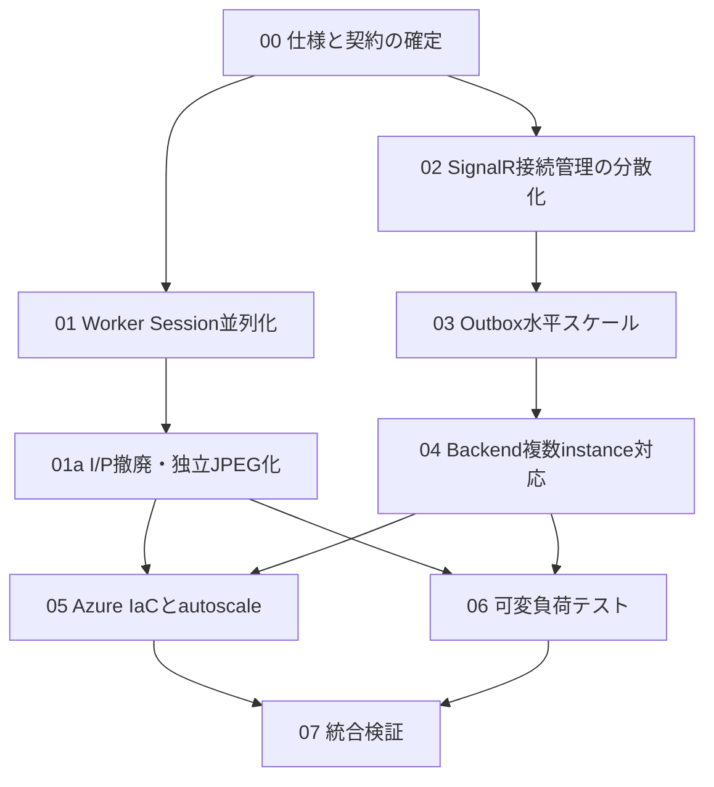

# 弾力的スケーリング実装 Agent Prompt 集

このディレクトリには、同時利用者数を固定せず、受講セッション数と負荷に応じて Azure 上で水平スケールできるようにするための実装 Agent 用Promptを置く。

各Markdownは、原則としてそのまま1つの実装Agentへ渡せる独立した依頼文である。

## 実行順

## ファイル一覧

| 順序 | Prompt | 主なwrite scope |
| --- | --- | --- |
| 0 | [`00-specification-and-contracts.md`](./00-specification-and-contracts.md) | `docs/**` |
| 1 | [`01-worker-session-concurrency.md`](./01-worker-session-concurrency.md) | `src/worker/**` |
| 1a | [`01a-remove-ip-frames.md`](./01a-remove-ip-frames.md) | Frame契約、Frontend、Backend frame pipeline、Worker JPEG decoder、関連テスト |
| 2 | [`02-distributed-signalr-registry.md`](./02-distributed-signalr-registry.md) | BackendのHub・接続registry・Redis連携・テスト |
| 3 | [`03-scalable-outbox-dispatcher.md`](./03-scalable-outbox-dispatcher.md) | BackendのOutbox・DB migration・テスト |
| 4 | [`04-backend-horizontal-scaling.md`](./04-backend-horizontal-scaling.md) | Backend health/readiness、SignalR設定、Frontend再接続テスト |
| 5 | [`05-azure-infrastructure-autoscale.md`](./05-azure-infrastructure-autoscale.md) | Azure IaC、運用ドキュメント |
| 6 | [`06-configurable-load-test.md`](./06-configurable-load-test.md) | 負荷試験ツール、fixture、実行ドキュメント |
| 7 | [`07-integration-and-acceptance.md`](./07-integration-and-acceptance.md) | scenario統合テスト、最終修正、検証報告 |

## 並列実行

`00` 完了後、`01` と `02` はwrite scopeが分離されているため並列実行できる。

ただしTask 01が完了済みでI/P撤廃を行う場合、`01a` を先に実施し、後続タスクは独立JPEGフレーム契約を前提にしてください。

以下は原則として順番に実施する。

- `01` → `01a`: Worker Session並列化の後、フレーム契約をI/Pから独立JPEGへ切り替える。
- `02` → `03`: Backendの接続registry契約をOutboxが利用するため。
- `03` → `04`: OutboxとSignalRの複数instance契約を確定してからhealth/readinessを整えるため。
- `01a`・`04` → `05`: 実際の設定名と実行方式をIaCへ反映するため。
- `01a`・`04` → `06`: 独立JPEGと複数instance通知を負荷試験対象にするため。
- `05`・`06` → `07`: 最後にscenario単位で統合確認するため。

同じBackendファイル、とくに `Program.cs`、`AwaverDbContext.cs`、migration、`AnalysisOutboxDispatcher.cs` を複数Agentに同時編集させないこと。

## 共通完了条件

- 同時利用者数をコードやIaCへハードコードしない。
- 同一 `sessionId` は直列、異なる `sessionId` は並列処理できる。
- Worker、Backend、Outboxを設定と負荷に応じて水平スケールできる。
- 複数Backend instanceでも正しいSignalR接続へ通知できる。
- 認証失効後の接続へ通知しない。
- Azure Service Bus Session、Azure SignalR Service、Container Apps autoscaleを利用できる。
- 既存のキャリブレーション、眠気判定、自動停止、顔未検出、認証、冪等性を壊さない。
- 秘密値をリポジトリへ追加しない。
