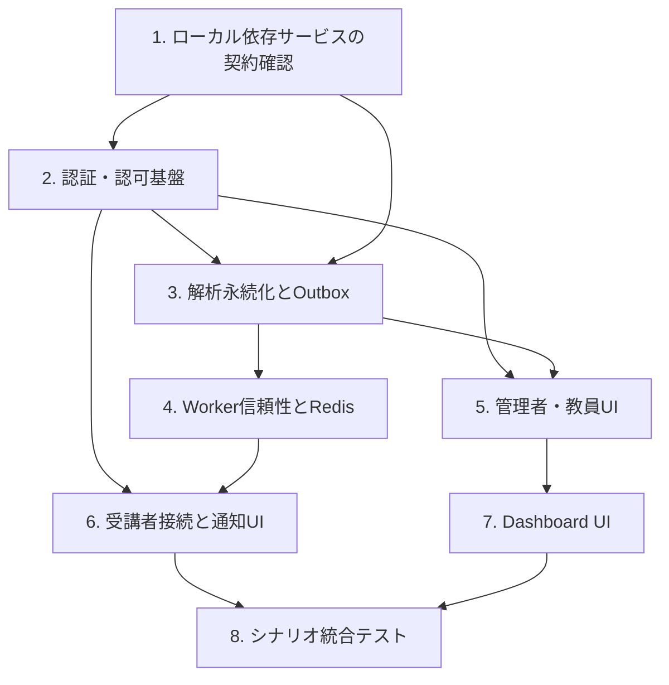

# 未完了シナリオを実装可能にする計画

## 1. 目的と一次情報

この計画は、以下のシナリオを実装可能な状態にするための実装順序である。実装時の振る舞いは常にFeature / Scenarioを優先する。

- [`admin-teacher-onboarding.md`](../scenarios/admin-teacher-onboarding.md)
- [`teacher-dashboard-review.md`](../scenarios/teacher-dashboard-review.md)
- [`student-learning-happy-path.md`](../scenarios/student-learning-happy-path.md)
- [`calibration-retry.md`](../scenarios/calibration-retry.md)
- [`drowsiness-auto-pause-resume.md`](../scenarios/drowsiness-auto-pause-resume.md)
- [`face-not-detected-warning.md`](../scenarios/face-not-detected-warning.md)

横断的な確定事項の一次情報は次の通りである。

| 論点 | 一次情報 |
| --- | --- |
| フレーム順序、再試行、ローカルE2E | [`04-frame-storage-and-queue.md`](../features/04-frame-storage-and-queue.md) |
| キャリブレーション永続化 | [`07-calibration.md`](../features/07-calibration.md) |
| Redis、スコア永続化、Worker受理 | [`08-drowsiness-scoring.md`](../features/08-drowsiness-scoring.md) |
| SignalR認可とOutbox配信 | [`09-realtime-notification.md`](../features/09-realtime-notification.md) |
| Cookie認証・パスワード・ログアウト | [`12-teacher-login.md`](../features/12-teacher-login.md) |
| 管理者の教員作成認可 | [`13-teacher-account-management.md`](../features/13-teacher-account-management.md) |
| Dashboardの読み取り契約 | [`14-teacher-dashboard.md`](../features/14-teacher-dashboard.md) |

## 2. 推奨実行順

`T2` と `T3` のDB migrationは同じ `AwaverDbContext` に関わるため、別担当が並列に作成せず、schema契約を固定して順番に実装する。`T5` と `T6` はAPI契約確定後に並列化できる。

## 3. タスク

### T1. ローカルE2E依存サービスを固定する

- **対象scenario:** `student-learning-happy-path`
- **依存:** なし
- **作業:** devcontainerのPostgreSQL、Redis、Azurite、Azure Service Bus Emulator（Session有効queue）を起動・healthcheck・queue設定まで検証する。Backend/Workerの本番アダプターがこの接続文字列で動くことを確認する。フレーム保存のファイルfallbackとキューのログ出力fallbackは、必要なら単体テストのtest doubleに限定する。
- **受け入れ条件:** クラウドAzure資格情報なしで、Session有効queueへの送受信、Azuriteへのフレーム書込み・読出し、Redis `PING`、PostgreSQL接続ができる。ログ出力のみをE2E成功としない。
- **想定変更ファイル:** `.devcontainer/docker-compose.yml`、`.devcontainer/servicebus-config.json`、`.devcontainer/.env.example`、`src/backend/Awaver.Backend/Program.cs`、`src/worker/app/main.py`、関連README/テスト。

### T2. Browser認証・認可を実装する

- **対象scenario:** `admin-teacher-onboarding`、`teacher-dashboard-review`、`student-learning-happy-path`
- **依存:** T1（ローカルのCookie/CORS検証のため）
- **作業:** 不透明なサーバー側 `auth_sessions` とHttpOnly Cookieを実装する。管理者・教員ログインでrole付きsessionを発行し、受講開始で当該 `sessionId` に束縛した短命`student_session`を発行する。`GET /api/auth/me`、`POST /api/auth/logout`、8時間絶対期限・30分アイドル期限、失効、CSRF保護を実装する。`adminId`をBodyから削除し、Controller、Dashboard API、WebSocket、SignalR Hubの認可をprincipalへ移す。
- **受け入れ条件:**
  - `sessionStorage` / `localStorage` 上のIDを書き換えても、管理者API、Dashboard API、他sessionのHub Group・WebSocketへアクセスできない。
  - 管理者だけが教員一覧・作成を実行でき、教員だけがDashboardを参照できる。
  - 受講者は自分の受講sessionだけを送信・購読・停止イベント記録できる。
  - ログアウト、期限切れ、role不足はそれぞれ仕様通り`401`/`403`となる。
- **想定変更ファイル:** `src/backend/Awaver.Backend/Program.cs`、`Controllers/AdminController.cs`、`Controllers/TeacherController.cs`、`Controllers/SessionsController.cs`、Dashboard Controller（新規または既存）、`Hubs/AnalysisEventsHub.cs`、`WebSockets/FrameWebSocketEndpoint.cs`、`Data/AwaverDbContext.cs`、`Models/AuthSession.cs`（新規）、`Migrations/*AuthSessions*.cs`（新規）、DTO、Backendテスト、`src/frontend/app/admin/teachers/admin-session-storage.ts`（削除）、`admin-teachers-page.tsx`、教員ログイン／Dashboard画面、`student-session-page.tsx`。

### T3. Backend所有の解析永続化とTransactional Outboxを実装する

- **対象scenario:** `calibration-retry`、`student-learning-happy-path`、`teacher-dashboard-review`
- **依存:** T2（Workerサービス認証のAPIポリシー）、T1
- **作業:** `calibrations`、`drowsiness_scores`、`analysis_event_outbox` のモデル・migrationを追加する。`POST /api/sessions/{sessionId}/analysis-results` を `analysis_worker` 専用にし、型検証、`sourceSequenceNo`による冪等性、キャリブレーション一件制約、スコアの一意性を実装する。解析行とOutbox行を同一トランザクションで保存する。OutboxディスパッチャーがSignalR/SSEへ配信し、失敗時にバックオフ再試行する。
- **受け入れ条件:**
  - 同一解析結果の再送は重複スコア・重複キャリブレーションを作らず成功する。異なる内容の同一冪等キーは競合として拒否する。
  - SignalR送信を失敗させてもスコア／キャリブレーションは残り、Outboxは未配信で再試行される。
  - Workerサービス資格情報なし、またはブラウザCookieだけの解析結果投稿は拒否される。
  - Dashboard APIはPostgreSQLの確定データだけを返す。
- **想定変更ファイル:** `src/backend/Awaver.Backend/Controllers/AnalysisResultsController.cs`、`Data/AwaverDbContext.cs`、`Models/Calibration.cs`（新規）、`Models/DrowsinessScore.cs`（新規）、`Models/AnalysisEventOutbox.cs`（新規）、`Services/AnalysisResultBroadcaster.cs`、Outbox Hosted Service（新規）、`Migrations/*AnalysisPersistence*.cs`（新規）、DTO、`Awaver.Backend.Tests/AnalysisResultsControllerTests.cs`、Dashboard Controller/テスト。

### T4. WorkerのPERCLOS状態とat-least-once処理を実装する

- **対象scenario:** `student-learning-happy-path`、`calibration-retry`、`drowsiness-auto-pause-resume`、`face-not-detected-warning`
- **依存:** T3
- **作業:** Redis Luaで`perclos:{sessionId}:frames`を重複`sequenceNo`除外、75件trim、TTL付きで更新する。WorkerのPostgreSQL直書きを実装せず、結果をBackend APIへサービス資格情報付きで送る。Blob取得／Redis／Backendの一時障害では`abandon`、入力・認証・非対応codecではdead-letter、Backendが受理して初めて`complete`するようにする。Pフレーム欠落は次IフレームまでGOPを捨てる。
- **受け入れ条件:**
  - 一時的なBlob/Backend障害ではフレームが再配送され、解析結果が重複保存されない。
  - 永続的なblob path不正・payload不正はdead-letterされ、理由が識別できる。
  - 顔未検出はPERCLOSへ入らず、tracking statusをBackend経由で通知する。
  - `danger`スコアと再開可能な`normal`スコアが、永続化後に通知される。
- **想定変更ファイル:** `src/worker/app/main.py`、Workerの新規Redis/Backend認証モジュール、`src/worker/shared/*`、`src/worker/tests/test_drowsiness.py`、`test_calibration.py`、`test_startup_checks.py`、新規retry/Redis統合テスト、`src/worker/requirements.txt`、環境設定例。

### T5. 管理者・教員のCookie連携UIを実装する

- **対象scenario:** `admin-teacher-onboarding`
- **依存:** T2
- **作業:** 管理者・教員ログインと全fetchをCookie資格情報利用に変更し、`sessionStorage`の管理者IDを削除する。`/api/auth/me`で初期表示・route guardを行い、`401`/`403`/期限切れ/ログアウトを画面状態として表示する。
- **受け入れ条件:** 管理者が教員を作成し、作成された教員がログインしてDashboardへ遷移できる。ブラウザ保存領域にprincipal ID・token・passwordが残らない。期限切れまたはログアウト後は保護画面が表示されない。
- **想定変更ファイル:** `src/frontend/app/admin/teachers/admin-teachers-page.tsx`、`admin-session-storage.ts`（削除）、`src/frontend/app/admin/teachers/page.tsx`、教員ログイン画面と共通API client（新規）、route guard、フロントエンドテスト。

### T6. 受講者の認証済み接続と通知UIを実装する

- **対象scenario:** `student-learning-happy-path`、`calibration-retry`、`drowsiness-auto-pause-resume`、`face-not-detected-warning`
- **依存:** T2、T4
- **作業:** `student_session` Cookieを送ってWebSocket・SignalRへ接続する。Hub再接続時に安全に再参加し、認可拒否をエラー画面へ反映する。Outboxから配信される`calibration_status`、`drowsiness_score`、`tracking_status`で、キャリブレーション再試行、5秒巻戻し自動停止、`normal`復帰後の明示再開、顔未検出Popupを制御する。
- **受け入れ条件:** 6本の受講者系scenarioの表示文言・状態遷移・再生制御が一次仕様通りである。他sessionを指定したWebSocket/Hub参加は失敗する。SignalR再接続後も正しいGroupにだけ復帰する。
- **想定変更ファイル:** `src/frontend/app/student/session/student-session-page.tsx`、WebSocket/SignalR hookまたはAPI client、通知型定義、関連コンポーネント・テスト。

### T7. 教員Dashboardの確定データ参照とリアルタイム補正を実装する

- **対象scenario:** `teacher-dashboard-review`
- **依存:** T2、T3、T5
- **作業:** Dashboard APIをteacher roleで保護し、セッション一覧、詳細、スコア、再生イベントをPostgreSQLから取得する。DashboardのSignalR接続をteacher Cookieで認証し、再接続時と選択変更時にRESTを再取得する。
- **受け入れ条件:** 教員は永続化済みの時系列と停止・再開タイムラインを確認できる。通知を取り逃しても再取得で表示が収束する。未認証・admin・studentはDashboard APIとHub購読を実行できない。
- **想定変更ファイル:** Dashboard Controller／DTO／クエリ／Backendテスト、`src/frontend/app/teacher/dashboard/teacher-dashboard-page.tsx`、`page.tsx`、グラフ・タイムライン関連コンポーネント／テスト。

### T8. scenario単位の統合確認を追加する

- **対象scenario:** 本計画の全scenario
- **依存:** T4、T5、T6、T7
- **作業:** 実サービスまたはdevcontainer Emulatorを使う統合テストと、ブラウザE2Eを追加する。単体テストだけで完了とせず、認証、永続化、再試行、リアルタイム通知、画面制御をシナリオごとに確認する。
- **受け入れ条件:** 6本のscenarioに対応するテストケースが存在し、少なくとも「ID偽装拒否」「Worker再送の冪等性」「SignalR配信失敗後のOutbox再試行」「顔未検出とdangerの停止／復帰」「Dashboard REST再取得」が自動確認される。
- **想定変更ファイル:** `src/backend/Awaver.Backend.Tests/*`、`src/worker/tests/*`、`src/frontend/*.{test,spec}.*`、E2Eディレクトリ（新規）、devcontainer test fixture。

## 4. 並列作業の境界

| 作業 | 共有契約 | 書込み境界 |
| --- | --- | --- |
| Backend認証（T2） | Cookie名、role、`/api/auth/me`、`/api/auth/logout` | Backend auth/controller/hub/websocket、認証migration |
| Backend解析永続化（T3） | Worker result payload、DB一意キー、Outbox payload | Backend analysis/model/migration/outbox、Dashboard query |
| Worker（T4） | T3のAPI schemaとエラー分類 | `src/worker/**` |
| Admin/Teacher UI（T5） | T2のauth API | `src/frontend/app/admin/**`、teacher login、共通auth client |
| Student UI（T6） | T2のstudent session、T3/T4の通知payload | `src/frontend/app/student/**` |
| Dashboard UI（T7） | T2/T3のAPI・SignalR | `src/frontend/app/teacher/dashboard/**` |

API payload、DB schema、role名、認可エラー、Service Bus failure分類はT2/T3完了時に固定する。以後の並列担当はその契約を変更せず、必要な仕様変更は一次仕様から提案する。
