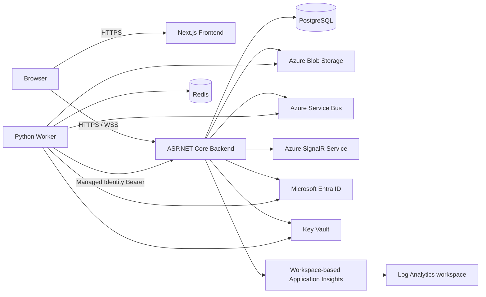

# 本番環境セットアップ手順

## 1. 目的と対象範囲

本書は AwakeVerify をAzure上の本番環境へ配置するために必要な、インフラ、Microsoft Entra ID、秘密情報、初期管理者、デプロイ後検証の手順をまとめる。

対象コンポーネントは以下とする。

- Next.js Frontend
- ASP.NET Core Backend
- Python Worker
- PostgreSQL
- Azure Blob Storage
- Azure Service Bus（Session有効queue）
- Redis
- Azure SignalR Service（複数 Backend instance の本番構成では必須）
- workspace-based Application Insights と Log Analytics workspace（Backend metrics-only telemetry）
- Microsoft Entra ID
- Azure Key Vault等の秘密情報ストア

振る舞いの一次仕様は `docs/features/` と `docs/scenarios/` である。本書はそれらを本番で稼働させるための運用手順であり、APIや画面の一次仕様ではない。

## 2. デプロイ前の必須ブロッカー

> **重要:** Production WorkerはMicrosoft Entra IDのBearer tokenを使用し、local/developmentだけが `WORKER_API_KEY` を使用する。下記のEntra ID設定と起動前疎通確認が完了するまで、Productionへ実データを流さないこと。

Productionデプロイ前に、以下を完了させること。

1. WorkerのSystem Assigned Managed Identityへ、Backend APIの `analysis_worker` app roleを割り当てる。
2. Backendでissuer、audience、`analysis_worker` app roleを検証する。
3. Development / local E2Eだけで `WORKER_API_KEY` を使用する。
4. Production Workerでは `WORKER_AUTH_MODE=entra_id` と `WORKER_BACKEND_TOKEN_SCOPE` を設定し、API keyを設定しない。
5. Managed Identityによる解析結果API投稿が `202 Accepted` になる統合確認を実行する。

実装済みの認証方式は、Backendの `Worker:AuthMode`（または `WORKER__AUTHMODE`）とWorkerの `WORKER_AUTH_MODE` で明示できる。ProductionではAPI keyを設定せず、`entra_id` を使用する。

## 3. 推奨構成



### 3.1 ネットワークとTLS

- Frontend、Backend、SignalRはTLSで公開する。
- FrontendとBackendは可能な限り同一siteで運用する。Cookie認証の安全性とCORS設定を単純化できる。
- 別originにする場合、Backendの `Cors:AllowedOrigins` に**正確なFrontend originだけ**を設定する。ワイルドカードを使わない。
- CORSでは資格情報付き通信を利用するため、許可originは明示的に固定する。
- Worker、PostgreSQL、Redis、Blob、Service Busはインターネットへ公開しない。Private Endpoint、VNet統合、ファイアウォール規則などで到達元を制限する。
- 本番の公開URL、HTTPS終端、リバースプロキシのforwarded headersは、Backend ACA ingress に合わせて検証する。ACA の TLS 終端後も `/health/live`、`/health/ready`、HTTP frame API、SignalR negotiate が redirect loop にならないことを確認する。
- Backend ACA には、network owner が確認した ingress proxy CIDR を `ForwardedHeaders__KnownNetworks__0` として渡す。`0.0.0.0/0`、client network、推測した public CIDR は使用しない。production Backend は trusted proxy/network 設定がない場合に起動を拒否するため、任意 client の `X-Forwarded-*` を信頼しない。

## 4. Azureリソースの準備

### 4.1 PostgreSQL

1. PostgreSQLを用意する。
2. Backendの実行Identityまたは秘密情報ストアから接続できるDBユーザーを作成する。
3. TLS接続を必須にする。
4. Backup、PITR、監査ログ、障害通知を有効化する。
5. Backend起動時にEF Core migrationを適用できる権限を、デプロイ時だけ付与するか、CI/CDでmigrationを先行適用する。

Backendは以下のいずれかから接続文字列を読み込む。

```text
ConnectionStrings__DefaultConnection
Postgres__ConnectionString
DATABASE_CONNECTION_STRING
```

本番では `DATABASE_CONNECTION_STRING` または `ConnectionStrings__DefaultConnection` をKey Vault参照として与えることを推奨する。

### 4.2 Azure Blob Storage

1. ストレージアカウントを作成する。
2. フレーム保存用containerを作成する。既定名は `frames`。
3. 保存データを暗号化する。
4. Blobの保持期間・削除方針を定め、Lifecycle Management Ruleを設定する。
   - 保持期間・削除の一次契約は [`15-elastic-session-frame-processing.md`](../features/15-elastic-session-frame-processing.md) とする。
   - `FRAME_BLOB_RETENTION_DAYS` とLifecycle Management Ruleを一致させ、通常の再配送・dead-letter調査に必要な期間より短く設定しない。
5. BackendはBlob書き込み、WorkerはBlob読み取りだけを必要とするよう、最小権限を設定する。

現行実装は接続文字列を使用する。BackendとWorkerで使用する設定名は以下である。

```text
BLOB_CONNECTION_STRING
AZURE_BLOB_STORAGE_CONNECTION_STRING
Azure__BlobStorage__ConnectionString

BLOB_CONTAINER_NAME
AZURE_BLOB_STORAGE_CONTAINER_NAME
Azure__BlobStorage__ContainerName
```

接続文字列を使う場合はKey Vaultへ保存し、ソース、Docker image、CIログ、`.env`へ入れない。

### 4.3 Azure Service Bus

1. Azure Service Bus namespaceを作成する。
2. frame queueを作成する。既定名は `frame-processing-queue`。
3. **Sessionを必ず有効化**する。
4. **duplicate detectionを必ず有効化**する。Backend は HTTP idempotency key `(sessionId, sequenceNo)` と同じ安定した Message ID を使う。history window は最大HTTP retry horizonより長くし、既定の `PT1H` をclient retry policyと別々に変更しない。
5. 最大配送回数、lock duration、dead-letter監視、アラートを設定する。
6. BackendからWorkerへ渡すフレームは、`sessionId` をService Bus Session IDとして送る。
7. Backendには送信権限、Workerには受信・complete・abandon・dead-letterのための権限を最小限で与える。ACA Service Bus scaler を使う場合は、Worker runtime credential を広げず、queue runtime metrics 読み取り用の `Manage` SAS を scaler 専用 secret として分離する。

現行実装は接続文字列を使用する。

```text
SERVICEBUS_CONNECTION_STRING
AZURE_SERVICE_BUS_CONNECTION_STRING
Azure__ServiceBus__ConnectionString

SERVICEBUS_QUEUE_NAME
AZURE_SERVICE_BUS_FRAME_QUEUE_NAME
Azure__ServiceBus__FrameQueueName
```

> 接続文字列を使う場合、BackendとWorkerに同一のRoot管理キーを配布しない。可能な限り、Backend送信専用・Worker受信専用の個別権限または個別SASを使用する。将来Managed Identity/RBAC対応へ移行する場合も、この最小権限を維持する。

### 4.3.1 Service Bus backlog と Worker autoscale

WorkerをAzure Container Appsで実行する場合、Service Bus Session有効queueのbacklogを主要トリガーに KEDA/Container Apps autoscale を設定する。min/max replica とqueue thresholdは [`15-elastic-session-frame-processing.md`](../features/15-elastic-session-frame-processing.md) の設定契約に従い、Azureクォータ内に収める。最古の未処理メッセージ年齢はautoscaleトリガーの代替ではなく、リアルタイム性の監視・アラート指標として収集する。

最大replica到達時もメッセージを破棄しない。Active message、最古メッセージ年齢、dead-letter、Session lock失敗、上限到達を可視化・通知する。

### 4.4 Redis

1. TLSを有効にしたRedisを用意する。
2. インターネットからのアクセスを無効化し、Workerだけが接続できるようにする。
3. Redis接続文字列をKey Vaultへ保存する。
4. Redisのメモリ上限、eviction policy、可用性、監視を運用要件に合わせて設定する。

Workerの設定名:

```text
REDIS_CONNECTION_STRING
WORKER_PERCLOS_TTL_SECONDS
```

`WORKER_PERCLOS_TTL_SECONDS` は最低86,400秒（24時間）でなければならない。

### 4.5 Azure SignalR Service

Azure本番で複数Backend instanceを扱う場合、Azure SignalR Serviceを必須とする。

```text
AZURE_SIGNALR_CONNECTION_STRING
Azure__SignalR__ConnectionString
```

未設定のローカル単一instance環境では、Backendは同一プロセス内SignalRとして動作する。複数Backend instanceの本番構成では、Azure SignalR Serviceに加え、接続・Session購読情報を共有 registry へ保存する実装が必要である。詳細は [`15-elastic-session-frame-processing.md`](../features/15-elastic-session-frame-processing.md) を参照する。

## 5. Microsoft Entra IDの設定

### 5.1 Backend APIのApp Registration

1. Microsoft Entra IDでBackend API用のApp Registrationを作成する。
2. Application ID URI / audienceを決定する。
3. Worker用の**Application app role**を作成する。
   - Display name: `Analysis Worker`
   - Value: `analysis_worker`
   - Allowed member types: `Applications`
4. Backendが受け取るaccess tokenに、`roles` claimとして `analysis_worker` が含まれる構成にする。
5. 発行元tenant、audience、OpenID Connect metadata endpointを確認する。

Backendには以下を設定する。

```text
Worker__Entra__Authority=https://login.microsoftonline.com/<tenant-id>/v2.0
Worker__Entra__Audience=<Backend APIのApplication ID URIまたは想定audience>
```

`Authority` と `Audience` は、tokenを発行するApp Registrationの設定と完全に一致させる。

### 5.2 WorkerのManaged Identity / Workload Identity

1. Workerを実行するAzureリソースにManaged Identityを有効化する。
   - Azure Container Apps
   - AKS Workload Identity
   - Azure VM / VMSS
   - Azure Functions
   など、採用する実行基盤の推奨方式を使う。
2. Worker identityのservice principalに、Backend APIの `analysis_worker` app roleを割り当てる。
3. Tenant管理者によるadmin consentが必要な場合は付与する。
4. WorkerがBackend API audience向けのtokenを取得できることを確認する。

Managed Identityを利用する場合、Workerにclient secret、証明書、固定API keyを配布しない。

### 5.3 本番認証の確認手順

Productionへフレーム処理を開始する前に、Worker identityで取得したtokenを使い、以下が成立することを確認する。

```text
POST /api/sessions/{sessionId}/analysis-results
Authorization: Bearer <managed-identity-access-token>
```

期待結果:

- 有効な`analysis_worker` roleを持つtoken: `202 Accepted`
- tokenなし: `401`
- audience不一致、issuer不一致、roleなし: `401` または `403`
- Browser Cookieだけ: `401` または `403`

## 6. 秘密情報管理

### 6.1 Key Vaultに置くもの

少なくとも以下はKey Vault、Container Apps secret、AKS Secret Store CSI Driverなどの秘密情報ストアで管理する。

| 種別 | 例 |
| --- | --- |
| DB | `DATABASE_CONNECTION_STRING` |
| Blob | `BLOB_CONNECTION_STRING` |
| Service Bus | `SERVICEBUS_CONNECTION_STRING` |
| Redis | `REDIS_CONNECTION_STRING` |
| SignalR | `AZURE_SIGNALR_CONNECTION_STRING` |
| 初期管理者 | `ADMIN_ID`、`ADMIN_PASSWORD` |
| local E2E専用 | `WORKER_API_KEY` |

### 6.2 禁止事項

以下は禁止する。

- 秘密値をGitへコミットする。
- `appsettings.json`、`appsettings.Production.json`、Dockerfile、compose fileに実値を書く。
- BrowserへWorker API key、DB接続文字列、Blob/Service Bus接続文字列を返す。
- ログ・例外メッセージ・監視イベントに秘密値を出力する。
- `WORKER_API_KEY` をProductionのManaged Identity代替として使う。

### 6.3 ローテーション

- 接続文字列、Redis password、初期管理者passwordはローテーション手順を持つ。
- 旧値と新値を短期間併用できる場合は、切替→動作確認→旧値失効の順に行う。
- `auth_sessions` の失効、管理者・教員password変更、Worker identityのrole削除が即時にアクセスを止めることを確認する。

## 7. 初期管理者のBootstrap

Backendは、起動時に以下の環境変数があり、同じ`adminId`がまだDBに存在しない場合だけ初期管理者を作成する。

```text
ADMIN_ID
ADMIN_PASSWORD
```

手順:

1. `ADMIN_ID` と強力な一回限りの `ADMIN_PASSWORD` を秘密情報ストアへ登録する。
2. migration適用を含む最初のBackendデプロイを行う。
3. `/api/admin/login` で初期管理者がログインできることを確認する。
4. 初期管理者で教員アカウントを作成する。
5. 初回作成後、`ADMIN_PASSWORD` を実行環境から削除するか、通常の管理者passwordローテーション運用へ移行する。

> `ADMIN_ID` がすでに存在する場合、Backendは既存管理者のpasswordを更新しない。初期値の変更をpasswordリセットの代わりに使用しないこと。

## 8. Backend環境変数一覧

以下は現行Backendが参照する主なProduction設定である。値は環境変数またはKey Vault参照として設定する。

| 設定 | 必須 | 用途 |
| --- | --- | --- |
| `DATABASE_CONNECTION_STRING` | 必須 | PostgreSQL接続 |
| `BLOB_CONNECTION_STRING` | 必須 | Blob Storage接続 |
| `AZURE_BLOB_STORAGE_CONTAINER_NAME` | 必須 | フレームcontainer名 |
| `SERVICEBUS_CONNECTION_STRING` | 必須 | Service Bus接続 |
| `AZURE_SERVICE_BUS_FRAME_QUEUE_NAME` | 必須 | Session有効frame queue名 |
| `Worker__Entra__Authority` | Production必須 | Worker Bearer tokenのissuer検証 |
| `Worker__Entra__Audience` | Production必須 | Worker Bearer tokenのaudience検証 |
| `AZURE_SIGNALR_CONNECTION_STRING` | 複数Backend instanceの本番では必須 | Azure SignalR Service |
| `APPLICATIONINSIGHTS_CONNECTION_STRING` | metrics-only telemetryを有効化する場合 | workspace-based Application Insights 接続。IaC管理時は Bicep が Backend ACA secretRef 経由でだけ設定し、deployment output・コマンド出力・ログへ値を出さない。 |
| `OUTBOX_BATCH_SIZE` | 任意 | Outbox dispatcherのclaim batch上限。正の整数。既定値100 |
| `OUTBOX_POLL_INTERVAL_MS` | 任意 | Outbox dueレコード確認間隔（ミリ秒）。正の整数。既定値250 |
| `OUTBOX_LEASE_SECONDS` | 任意 | Outbox claim lease期間（秒）。正の整数。既定値30 |
| `Cors__AllowedOrigins__0` など | 必須 | 明示したFrontend origin |
| `ADMIN_ID` | 初回だけ | 初期管理者ID |
| `ADMIN_PASSWORD` | 初回だけ | 初期管理者password |

`Azure__BlobStorage__ConnectionString`、`Azure__ServiceBus__ConnectionString`、`ConnectionStrings__DefaultConnection` などの.NET階層形式も使用できる。ただし、同じ設定を複数の環境変数へ重複設定しない。

## 9. Worker環境変数一覧

| 設定 | 必須 | 用途 |
| --- | --- | --- |
| `WORKER_BACKEND_BASE_URL` | 必須 | Backend ACA ingress FQDN の HTTPS URL。Worker はこの URL 以外のBackend、Blob、Service Bus、Redis、PostgreSQLへ直接投稿しない。 |
| `AZURE_SERVICE_BUS_CONNECTION_STRING` | 必須 | Service Bus接続 |
| `AZURE_SERVICE_BUS_FRAME_QUEUE_NAME` | 必須 | Session有効frame queue名 |
| `AZURE_BLOB_STORAGE_CONNECTION_STRING` | 必須 | Blob Storage接続 |
| `AZURE_BLOB_STORAGE_CONTAINER_NAME` | 必須 | フレームcontainer名 |
| `REDIS_CONNECTION_STRING` | 必須 | PERCLOS状態 |
| `WORKER_MODEL_PATH` | 必須相当 | MediaPipe modelファイルへのパス |
| `WORKER_PERCLOS_TTL_SECONDS` | 任意 | Redis PERCLOS TTL。最低86400秒 |
| `WORKER_SESSION_CONCURRENCY` | 任意 | Worker replica内のSession slot数。正の整数、既定1 |
| `WORKER_SHUTDOWN_TIMEOUT_SECONDS` | 任意 | graceful shutdownの最大待機時間（秒）。正の値、既定30 |
| `WORKER_MIN_REPLICAS` | IaCで必須 | Worker replica下限。0以上 |
| `WORKER_MAX_REPLICAS` | IaCで必須 | Worker replica上限。下限以上かつAzureクォータ以下 |
| `WORKER_SCALE_QUEUE_THRESHOLD` | IaCで必須 | backlogによるscale-out閾値。正のメッセージ数 |
| `WORKER_MAX_DELIVERY_COUNT` | 任意 | dead-letter前の最大配送数 |
| `WORKER_POST_TIMEOUT_SECONDS` | 任意 | Backend投稿timeout |
| `WORKER_HEALTH_HOST` | 任意 | health endpoint bind host |
| `WORKER_HEALTH_PORT` | 任意 | health endpoint port |
| `WORKER_API_KEY` | local E2Eだけ | ローカルWorker API認証 |
| `WORKER_AUTH_MODE` | Production必須 | `entra_id`。Managed Identity / Workload IdentityでBackend tokenを取得する。 |
| `WORKER_BACKEND_TOKEN_SCOPE` | Production必須 | Backend API audienceに対する `/.default` scope。 |
| `WORKER_BACKEND_CLIENT_ID` | 任意 | User Assigned Managed Identityを使用する場合だけ設定する client ID。 |

Workerの `DefaultAzureCredential` は ACA の Managed Identity を使用する。Backend API App Registration上の `analysis_worker` app role 割当は Entra 管理操作であり、Container Apps作成だけでは完了しない。

## 10. デプロイ手順

### 10.1 独立JPEGフレーム契約への破壊的リリース

このリリースではraw frame WebSocket と Service Busフレーム参照メッセージから廃止済みのフレーム間参照フィールドを削除する。frame は Backend ACA の HTTPS binary API でだけ受け付け、SignalR は解析結果通知だけを維持する。旧Frontendと新Backendを混在させる互換レイヤーは提供しないため、以下の順で切り替える。

1. フレームを送信するFrontendを停止するかメンテナンス状態にし、既存frame queueをdrainする。drainできない場合は、Session有効の新しいframe queueを作成してBackendとWorkerの設定を同時に切り替える。
2. FrontendとBackend ACAを同一releaseとしてデプロイし、新しい独立JPEGの HTTPS binary 契約だけを受け付ける。
3. 新しい参照メッセージだけを受理するWorkerをデプロイする。旧queueに残ったメッセージは処理対象にしない。
4. Browser / load-test から Backend ACA の `POST /api/sessions/{sessionId}/frames/{sequenceNo}` へ raw `image/jpeg` body を送り、Backend が Blob と Service Bus へ durable acceptance 後に `202` を返すことを確認する。Browser は Blob、Service Bus、Worker へ直接接続しない。
5. フレームBlobは短期保持であり、旧パス形式のBlobは移行しない。保持期間とdead-letter調査要件がこれと矛盾する場合は、切り替え前に運用要件を見直す。

### 10.2 Azure IaCによる非本番の分散負荷テスト環境

ローカルでBackend/Worker replicaを増やす `docker-compose.scaling.yml` は廃止した。通常のDevcontainer Composeは単体・少数メッセージのE2Eと負荷生成シナリオの確認だけに使用し、Service Bus backlogによるWorker autoscale、scale-in、cold start、実ネットワークの負荷測定はAzureで実施する。

非本番環境のBicep、secure parameter契約、`az` によるvalidate/deploy、warm-up、scale-to-zero、監視項目は [`../../infra/azure/README.md`](../../infra/azure/README.md) を正とする。Backend ACA は既定の `backendMinInstances=2`、`backendMaxInstances=2`、HTTP concurrent-request scale rule を使用するが、ACA Consumption cores quota、Azure for Students credit、コスト上限を確認するまで実デプロイしない。PostgreSQL SKU は測定結果を確認するまで変更しない。Backend Application Insights の connection string は Bicep が ACA secretRef 経由で渡すだけであり、deployment output や本書のコマンド出力例に表示しない。

### 10.3 通常のデプロイ手順

1. Azureリソース、Private Network、DNS、TLS証明書を準備する。
2. Backend APIのApp RegistrationとWorker identity / `analysis_worker` role割当を設定する。
3. Key Vaultへ秘密情報を登録し、Backend・Workerの実行Identityに読み取り権限を与える。
4. PostgreSQLのbackupと復旧方針を確認する。
5. Service Bus queueがSession有効であることを確認する。
6. Backendをデプロイする。
7. Backendがmigrationを正常に適用し、初回だけ初期管理者を作成したことを確認する。
8. Workerをデプロイする。
9. Workerのhealth endpoint、Blob、Service Bus、Redis、Backend APIへの接続を確認する。
10. Frontendをデプロイし、CORS origin、CookieのSecure属性、HTTPS / WSS接続を確認する。
11. 受講者、管理者、教員のシナリオ統合確認を実施する。
12. 監視、アラート、dead-letter queue、Service Bus backlog・最古メッセージ年齢、Outbox未配信件数・最古Outbox年齢・lease期限切れの監視を有効化する。

## 11. デプロイ後の受け入れ確認

### 認証・認可

- 管理者だけが教員一覧・教員作成を実行できる。
- 教員だけがDashboard APIとDashboard画面を利用できる。
- 受講者は自身のsessionだけでSignalR Hub購読と再生イベント記録を利用できる。raw JPEG frame 用 WebSocket は存在しない。
- Workerだけが解析結果APIへ投稿できる。
- logout、session revoke、期限切れ後に保護API・Hub購読が拒否される。

### 解析パイプライン

- Browser / load-test → Backend ACA HTTPS binary frame API → Blob → Service Bus → Worker ACA → Backend ACA → Outbox → SignalR の経路が成立する。
- Service Bus Sessionにより同一sessionの独立JPEGフレームが順序どおり処理され、キャリブレーションとPERCLOS状態が直列更新される。
- Blob、Redis、Backendの一時障害でmessageがabandonされ、再配送される。
- 恒久エラーはdead-letterされ、理由を識別できる。
- Worker再起動後も成功済みキャリブレーションが復元され、同じ閾値でスコアリングを継続する。
- `sequenceNo` の欠落があっても後続の有効JPEGが解析される。
- 同一frameの再配送でPERCLOS、score、Outbox通知が重複しない。

### 受講UI

- キャリブレーション成功前は動画が再生できない。
- `danger` で動画が5秒巻き戻されて停止する。
- `normal` 復帰後に受講者の明示操作でだけ再開できる。
- 顔未検出で動画が停止し、顔復帰後に指定の再開Popupが表示される。
- SignalR切断・再接続中は動画とフレーム送信が停止する。
- `auto_pause` と `resume` がCSRF保護下でPostgreSQLへ保存される。

### 教員Dashboard

- セッション一覧、最新眠気レベル、スコア時系列、停止・再開イベントがPostgreSQLから取得できる。
- SignalR通知を逃した場合でも、REST再取得で表示が収束する。
- スコアやイベントがない場合の空状態が表示される。

## 12. 監視・アラート

最低限、以下を監視対象にする。

| 対象 | 監視内容 |
| --- | --- |
| Backend | 5xx、401/403急増、応答時間、Worker result API の timeout / latency、結果保存・Outbox transaction の成功/失敗、Outbox未配信件数・最古Outbox年齢・claim/lease期限切れ、migration失敗、Backend instance 数・CPU |
| Application Insights / Log Analytics | Backend の metrics-only telemetry、ingestion量、短期保持期間、query / alert の費用。複数 Backend instance の gauge は sum ではなく max で監視する。 |
| Worker | health失敗、解析失敗、retry回数、dead-letter件数、Session slot利用率、replica数・上限到達、モデルロード失敗 |
| Service Bus | Active message、最古メッセージ年齢、Dead-letter message、Session lock失敗、配送回数 |
| PostgreSQL | 接続数、CPU、容量、失敗クエリ、backup失敗 |
| Redis | メモリ、接続数、eviction、PING失敗 |
| Blob Storage | 読み書き失敗、容量、Lifecycle実行状況 |
| SignalR | 接続数、送信失敗、再接続増加 |
| 認証 | login失敗急増、CSRF拒否、期限切れ、権限拒否 |

ログおよび Application Insights telemetry には学生ID、`sessionId`、HTTP frame / SignalR message payload、画像・Base64、password、Cookie値、Bearer token、API key、接続文字列を出力しない。Backend telemetry は privacy 上 metrics-only とし、成功/失敗数、timeout数、duration、Outbox backlog / age の集計値だけを送信する。Application Insights と Log Analytics の ingestion および短期保持には料金が発生するため、不要な高頻度・高 cardinality metric を送信せず、負荷試験後は保持期間とリソース削除を確認する。

## 13. ロールバックと障害対応

- DB migrationを含むデプロイでは、事前backupとrollback手順を用意する。
- 非互換migrationはexpand / migrate / contractの段階的方式を使い、アプリケーションとDBを同時に壊さない。
- Workerの認証失敗、Outbox滞留、dead-letter急増を検知した場合は、新規受講を停止または警告し、原因を解消してから再開する。
- 独立JPEGフレーム契約の破壊的リリースをロールバックする場合、旧Frontend／Backend／Workerを一体で戻し、切り替え後のframe queueを処理しない。旧契約と新契約のメッセージを同じqueueで混在処理しない。
- 解析結果を失わないため、WorkerはBackend `202 Accepted` 前にService Bus messageをcompleteしてはならない。
- 認証情報漏えい時は、該当する接続文字列・SAS・passwordを即時ローテーションし、必要ならauth sessionを失効させる。

## 14. 本番投入判定チェックリスト

- [ ] Production WorkerのManaged Identity Bearer認証が実装・統合テスト済み
- [ ] `analysis_worker` app roleがWorker identityへ割り当て済み
- [ ] Backendのissuer / audience / role検証設定済み
- [ ] Service Bus queueがSession有効
- [ ] Worker Session並列度、Container Apps min/max replica、backlog autoscale、Azureクォータが設定・検証済み
- [ ] Azure本番の複数Backend instanceでAzure SignalR Serviceと共有接続registryが設定済み
- [ ] Blob Lifecycle Ruleと`FRAME_BLOB_RETENTION_DAYS`が整合している
- [ ] Blob、Service Bus、Redis、PostgreSQLの秘密情報がKey Vault等で管理されている
- [ ] TLS、CORS、Cookie、Private Networkを確認済み
- [ ] 初期管理者を安全に作成済み
- [ ] EF Core migrationとDB backupを確認済み
- [ ] Worker restart・再配送・dead-letterの統合テスト済み
- [ ] studentのCSRF付き停止・再開イベント保存を確認済み
- [ ] SignalR再接続時の受講停止・復帰を確認済み
- [ ] DashboardのREST再取得・リアルタイム補正を確認済み
- [ ] Outbox未配信・Service Bus DLQ・Worker healthの監視とアラートを設定済み
- [ ] 本書の「デプロイ前の必須ブロッカー」が解消済み
